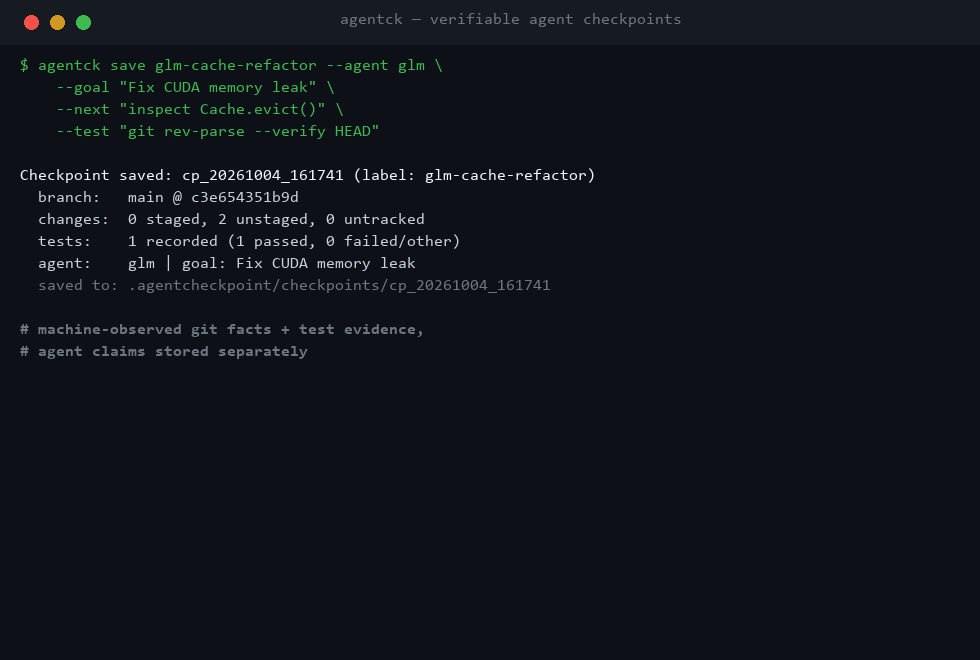

<div align="center">

# 📌 AgentCheckpoint

**コーディングエージェントのための、検証可能で復元可能な実行チェックポイント**

`agentck` は、コーディングエージェントのセッションの実際の作業状態——git の状態、
テスト実行の証跡、エージェント自身の主張（それぞれ*別々*に保存）——を凍結し、
次のエージェントが作業を始める前に、その状態がまだ信頼できるかを伝えます。

[](https://github.com/hwl668/Agentcheckpoint/actions/workflows/ci.yml)
[](https://pypi.org/project/agentck/)
[](https://pypi.org/project/agentck/)
[](LICENSE)
[](https://github.com/astral-sh/ruff)

[インストール](#-インストール) · [クイックスタート](#-クイックスタート) · [コマンド一覧](#-コマンド一覧) · [仕組み](#-仕組み) · [ロードマップ](#-ロードマップ)

[简体中文](README.md) · [English](README.en.md) · **日本語** · [Español](README.es.md) · [Русский](README.ru.md)



</div>

## 💡 なぜ必要か

ハンドオフツールの多くは「要約」をします。しかし要約では、次の 3 つの致命的な
問いに答えられません：

- あのテストが通った後、**コードは drift（変質）していないか？**
- 「完了した」という主張に、**証拠はあるか？**
- リポジトリを**正確に**当時の状態へ戻せるか？

AgentCheckpoint は一つの鉄則で答えます：

```text
エージェントの要約 ≠ 事実
```

すべての情報は 3 つのクラスに分類され、別々に保存・別々に表示され、混線しません：

```text
CLAIM:      "fixed cache eviction"            ← エージェントの主張
OBSERVED:   src/cache.py modified             ← マシンが収集（git）
VERIFIED:   pytest tests/test_cache.py → exit 0
STALE:      src/cache.py changed afterwards   ← drift 後に「期限切れ」表示
```

これにより `agentck verify` は、引き継ぐ前に次のような判定を返します：

```text
Files
! src_cache.py changed since checkpoint
Tests
! git rev-parse --verify HEAD
  PASS at checkpoint — result is now STALE
Claims
? "switched eviction policy to LRU"
  agent-reported, not independently verified

Resume confidence: 75%
```

終了コードはスクリプト化可能：`0` drift なし · `1` drift あり · `2` エラー。

## ✨ 主な特徴

|  | 特徴 | 説明 |
|---|---|---|
| 🔖 | **証拠クラス** | OBSERVED / VERIFIED / AGENT-REPORTED を一貫してタグ付け。主張が事実として表示されることはありません |
| 🕵 | **drift 検出** | HEAD 移動・ブランチ変更・ファイルハッシュ差分 → 記録済みテスト結果を STALE に |
| 🔐 | **整合性検証** | 全アーティファクトの SHA256 を記録。verify / restore は再ハッシュし、不一致なら拒否——破損や想定外の変更は検出しますが、意図的な攻撃者への耐性は別問題です |
| 🔁 | **実行リプレイ** | checkpoint に記録したコマンドを再実行し consistent / regression / improved を判定 |
| 🌳 | **Checkpoint DAG** | `--parent` で任意ノードから分岐、`log` でツリー表示 |
| 🛟 | **安全な復元** | デフォルトは新規 git worktree。現在のツリーには一切触れず、in-place は `--yes` 必須＋ safety checkpoint 自動作成 |
| 🤖 | **モデル非依存** | エンジンは特定エージェントを知りません。Claude / Codex / GLM は単なる別 renderer |
| 📦 | **ローカルファースト** | 実行時依存ゼロ（Python ≥ 3.10 + git）。データはプロジェクト内。アカウント不要・オフライン・LLM 呼び出しなし |

## 📦 インストール

<details open>
<summary><b>ソースからグローバルに一度インストール（推奨）</b></summary>

```bash
git clone https://github.com/hwl668/Agentcheckpoint.git
cd Agentcheckpoint

# 初回のみ（pipx が無い場合）：
py -3 -m pip install --user pipx          # POSIX: python3 -m pip install --user pipx

# グローバルインストール（editable：ソース変更が即反映）：
py -3 -m pipx install -e .
py -3 -m pipx ensurepath                  # ~/.local/bin を PATH に追加（一度だけ）
```

新しいターミナルで：

```bash
cd ~/projects/any-project
agentck --version
agentck init
```

</details>

<details>
<summary><b>その他の方法</b></summary>

```bash
pipx install agentck                # PyPI 公開後
uv tool install agentck             # uv ユーザー
py -3 -m pip install --user .       # 通常の pip（venv 分離なし）
```

> 名前について：PyPI 上のディストリビューション名は **`agentck`**
> （`agentcheckpoint` は別プロジェクトが使用済み）。Python パッケージは
> `agentcheckpoint`、コマンドは `agentck` のままです。

</details>

**CLI はグローバル、データはプロジェクトごと**：各リポジトリは自分の
`.agentcheckpoint/` を持ち（`.git/info/exclude` でローカル除外、
`.gitignore` は触りません）、store は互いに独立。git リポジトリ外では
すべてのコマンドが安全に失敗します（exit 2）。

## 🚀 クイックスタート

```bash
cd my-project
agentck init
```

エージェントと作業した後、状態を凍結：

```bash
agentck save glm-cache-refactor \
    --agent glm \
    --goal "Fix CUDA memory leak" \
    --completed "switched eviction policy to LRU" \
    --decision "preserve public Cache API" \
    --blocker "test_large_batch fails" \
    --next "inspect Cache.evict() around line 184" \
    --do-not "modify allocator.cpp" \
    --test "git rev-parse --verify HEAD"
```

`--test` のコマンドは**その場で実行**され、終了コードと出力末尾が機械的な証拠として
記録されます。別のエージェントへ引き継ぐとき：

```bash
agentck verify            # 状態はまだ信頼できるか
agentck resume codex > HANDOFF.md
```

信頼できる checkpoint に戻りたいとき：

```bash
agentck restore cp_20261004_161741      # 新規 worktree へ復元。現在のツリーは無傷
```

## 🧰 コマンド一覧

| コマンド | 用途 |
|---|---|
| `agentck init` | `.agentcheckpoint/` を初期化（ローカル除外も設定） |
| `agentck save [label] [--goal …] [--test cmd] [--parent ref]` | 現在の状態を凍結。`--test` は実行して証跡を記録 |
| `agentck list [--json]` | 全 checkpoint の一覧 |
| `agentck log` | checkpoint DAG のツリー表示（分岐・断絶が見える） |
| `agentck show [ref] [--json]` | checkpoint の詳細 + handoff ドキュメント |
| `agentck diff <a> <b>` | 2 つの checkpoint の差分 |
| `agentck verify [ref] [--json]` | drift / 期限切れ / 整合性 / 信頼度（exit 1 = drift あり） |
| `agentck replay [ref] [--json]` | 記録済みコマンドを再実行して比較（exit 1 = リグレッション） |
| `agentck resume [claude\|codex\|glm\|plain]` | 次のエージェントへの証拠タグ付き引き継ぎドキュメント |
| `agentck restore <ref>` | 状態を復元（デフォルト worktree。`--in-place --yes` で現ツリーを書き換え） |

参照には `latest`・完全な ID・一意なプレフィックス・label が使えます。

## 🧠 仕組み

各 checkpoint は人間が読めるディレクトリです（スキーマ `agent-checkpoint/v1`）：

<details>
<summary><b>checkpoint の構成</b></summary>

```text
.agentcheckpoint/checkpoints/cp_20261004_161741/
├── manifest.json        # checkpoint 本体（agent claims + 機械観測）
├── handoff.md           # save 時にレンダリングされた静的ハンドオフ
├── integrity.json       # 全アーティファクトの SHA256 —— 整合性検証
├── git/                 # OBSERVED: status.json, staged.patch, tracked.patch, untracked/
├── execution/           # OBSERVED: tests.json（コマンド・終了コード・出力末尾）
└── semantic/            # AGENT-REPORTED: decisions.md, constraints.md, next-steps.md
```

</details>

3 つのハードルール：

1. **git の事実は常に git コマンドから収集**し、LLM には生成させません。
   ハルシネーションは ground-truth 層を汚染できません。
2. **主張と観測は別々に保存**：goal / completed / decisions / blockers は
   `agent_claims` のみに入り、常に「未検証」ラベル付き。
3. **checkpoint は追記専用**：verify と restore は全体を再ハッシュし、
   破損や想定外の変更は検出されます。integrity.json は自身をハッシュできません——
   意図的な攻撃者に耐えるには署名付き checkpoint が必要です（ロードマップ参照）。

信頼度ヒューリスティックの正確な数式、DAG とリプレイのセマンティクスは
[プロトコル仕様（英語）](spec/agent-checkpoint-v1.md)を参照。

## 🛡 安全設計と既知の限界

- 復元はデフォルトで新規 worktree。`--in-place` は明示的な `--yes` が必要で、
  常に最初に `pre-restore-` safety checkpoint を自動保存します。
- checkout と patch 適用は `core.autocrlf=false` を強制し、復元結果のバイト列が
  保存時のハッシュと完全一致することを保証します。
- 意味入力と記録された出力は**ベストエフォートでシークレットをマスク**。
  patch 内の疑わしいシークレットは警告のみ（書き換えると整合性が壊れるため）。
- v1 の正直な限界：unmerged（コンフリクト）状態は記録できるが復元は不可。
  verify はコマンドを再実行しない（再実行は `agentck replay`）。
  マスキングはベストエフォートであり保証ではありません。

## 🧭 ロードマップ

- [x] `agent-checkpoint/v1` プロトコル全体（save / verify / resume / restore / diff）
- [x] Checkpoint DAG + 実行リプレイ
- [ ] Claude Code hooks による自動 checkpoint（セッション終了時・危険操作前）
- [ ] エージェントプラットフォーム別 Skill パッケージ
- [ ] checkpoint 品質スコア
- [ ] 署名付き checkpoint（Merkle ルート + Ed25519/SSH/Sigstore）

## 🤖 エージェント統合

Claude / Codex / GLM に agentck を正しく使わせましょう：
[`skills/agent-checkpoint/SKILL.md`](skills/agent-checkpoint/SKILL.md)
をエージェントに組み込んでください。いつ checkpoint すべきか、主張は具体的で
検証可能であるべきこと、そして「`--test` で記録していないのに tests pass と
主張しない」という証拠の規律が定められています。

## 💻 開発

```bash
py -3 -m venv .venv && .venv/Scripts/pip install -e ".[dev]"
.venv/Scripts/pytest          # 68 テスト、すべて密閉された一時 git リポジトリ上
.venv/Scripts/ruff check .
```

詳細ドキュメント（英語）：[SPEC.md](SPEC.md) ·
[プロトコル仕様](spec/agent-checkpoint-v1.md) · [CHANGELOG](CHANGELOG.md)

---

<div align="center">

**MIT** © AgentCheckpoint contributors

CLI はグローバル、データはプロジェクトごと。

</div>
